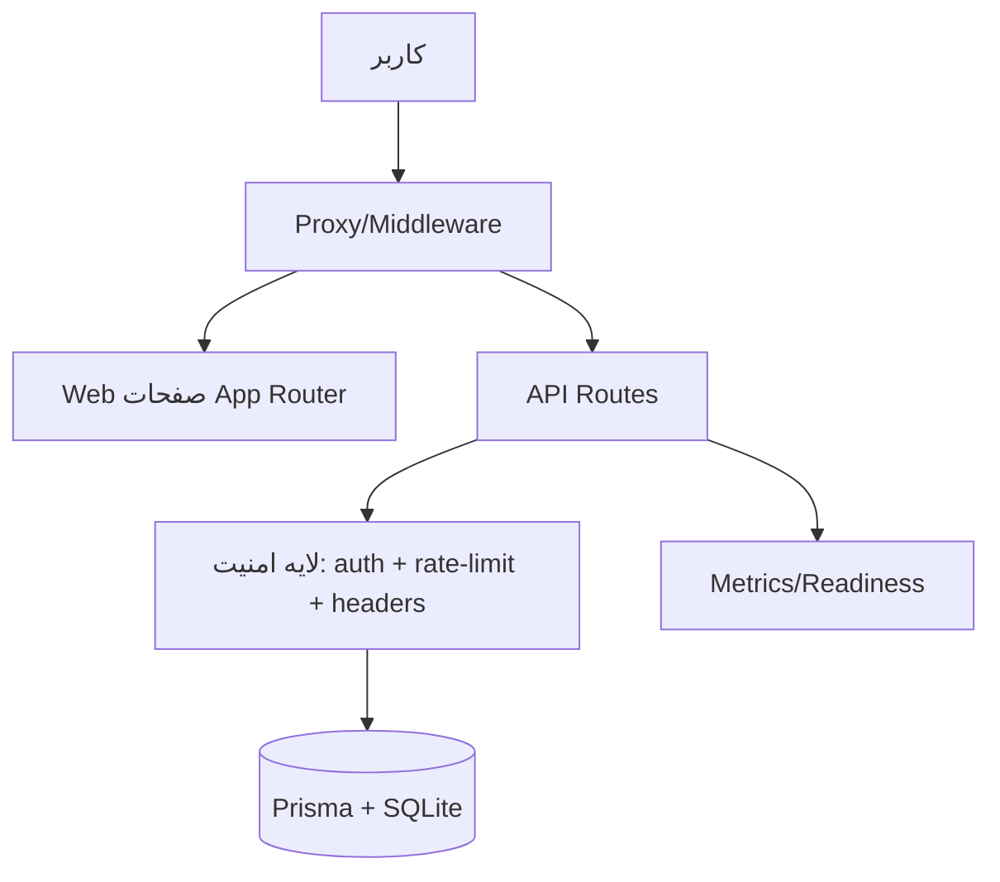
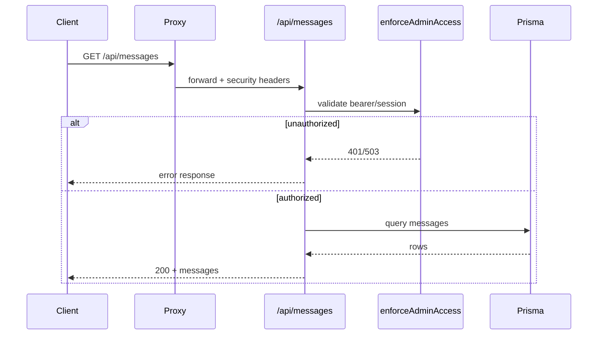

# معماری و جریان‌ها

## ساختار منطقی
- `src/app/*`: صفحات، layout، و API routeها
- `src/lib/*`: env، امنیت، rate-limit، auth، db، logger
- `src/__tests__/*`: تست‌های واحد/یکپارچه API و کتابخانه‌ها

## چرخه درخواست (Request Lifecycle)
1. درخواست وارد `proxy` می‌شود و هدرهای امنیتی/CSP/Cache اعمال می‌شود.
2. برای مسیرهای `admin/*` اعتبار session بررسی می‌شود.
3. API route با `createRequestId` و `withCommonApiHeaders` پاسخ استاندارد تولید می‌کند.
4. برای endpointهای حساس، `checkRateLimit` و اکنون `enforceAdminAccess` اعمال می‌شود.

## جریان احراز هویت
- روش‌ها:
  - Bearer token (`ADMIN_API_TOKEN`)
  - Session cookie امضاشده HMAC (`asdev_admin_session`)
- ورود ادمین در `api/admin/auth/login`، خروج در `logout`، وضعیت در `session`.

## جریان داده
- persistence با Prisma روی SQLite (`prisma/schema.prisma`).
- پیام‌ها/leadها در مدل `ContactMessage` ذخیره می‌شوند.

## تغییر معماری اعمال‌شده
- مسیر عمومی `api/messages` قبلا بدون auth بود؛ اکنون با `enforceAdminAccess` محدود شد.
- endpoint جدید `api/ready` برای readiness و چک DB افزوده شد.

## شواهد
- `src/proxy.ts:70`
- `src/lib/admin-auth.ts:138`
- `src/app/api/messages/route.ts:9`
- `src/app/api/ready/route.ts:7`
- `prisma/schema.prisma:67`

## دیاگرام معماری (Mermaid)

